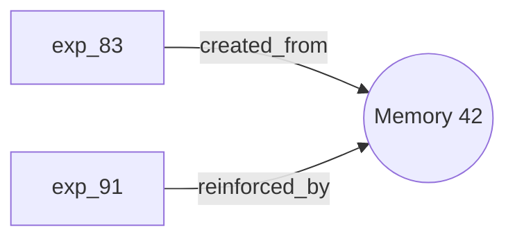

# @yoda-digital/waywiser-brain

Self-learning, auto-evolving brain extension for Pi.

## What It Does

Brain observes Pi sessions, extracts durable knowledge, accumulates procedural patterns, and evolves them into native Pi skills through competitive evaluation.

```
USER TASK → BRAIN RECALL → PI ACTS → AGENT SETTLED
    ↓
EXPERIENCE (structured tool events + outcome)
    ↓
LEARN (deterministic extraction → reflective LLM pass)
    ↓
MEMORIES + PROCEDURES (with traceable provenance)
    ↓
MATURE PROCEDURE? → CANDIDATE SKILL → COMPETITIVE EVAL
    ↓
PROMOTE / REJECT / ROLLBACK
    ↓
ACTIVE PI SKILL → NEXT SESSION → ACT BETTER
```

## Key Principles

1. **Pi-native only** — Every lifecycle event, state persistence, and skill injection uses Pi's extension API directly. No middleware, no daemon.
2. **Evidence before belief** — No memory or skill change without traceable provenance to a real Pi event.
3. **Prompt-cache stability** — System prompt never changes mid-session. Memory context is injected via `before_agent_start` custom messages.
4. **Kernel safety** — Brain can evolve memories, procedures, and skills. It cannot rewrite its own policy, provenance rules, or evaluation kernel.

## Architecture

Brain is a Pi package with 18 composable modules (5,666 lines of TypeScript):

| Module | Purpose |
|--------|---------|
| **config** | Configuration with defaults, deep-merge, env overrides |
| **store** | SQLite database — schema (12 tables), migrations, CRUD |
| **provenance** | Deterministic source classification (user/agent/external/environment) |
| **trace** | ExperienceTrace — structured event collection from Pi tool_call/tool_result |
| **recovery** | Deterministic tool failure → recovery linking by target key |
| **recall** | Reciprocal rank fusion retrieval (lexical + scope + usage + confidence + recency) |
| **learner** | Two-pass learning: deterministic extraction then reflective LLM analysis |
| **procedures** | Procedural memory with evidence tracking, maturity thresholds |
| **consolidate** | Superseded cleanup, stale archival, near-duplicate detection, contradiction flagging |
| **skills** | Skill lifecycle (active/candidates/retired) with Pi `resources_discover` integration |
| **eval** | Competitive baseline vs candidate evaluation with oracle checks |
| **evolve** | Evolution pipeline: mature procedure → compile → validate → evaluate → promote |
| **vault** | Obsidian-compatible markdown projection + bidirectional session-boundary sync |
| **policy** | Scope inference, promotion eligibility, immutable safety boundaries |
| **cognition** | Pi meta-worker pool (`pi --print` mode, isolated, no extensions) |
| **prompts** | All LLM prompt templates (gate, consolidate, compile, judge) |
| **index** | Root extension — Pi event lifecycle, `evolve` tool, `/brain` commands |
| **types** | All shared TypeScript types |

## Test Coverage

**269 unit tests** across 16 test files + **54 waywiser regression tests** = **323 total, 0 failures**.

```bash
# Brain tests
cd brain && node --test test/*.test.ts

# Full suite including waywiser
cd .. && node --test test/*.test.ts
```

Tests cover: schema idempotency, unicode tokenization (Romanian, Russian), reciprocal rank fusion, deterministic extraction, procedure lifecycle, skill promotion/rollback, vault round-trips, safety boundaries, and end-to-end flows.

## Pi Events Used

| Event | Brain Action |
|-------|-------------|
| `resources_discover` | Expose `skills/active/` to Pi's native skill discovery |
| `session_start` | Reload config, reset state, vault inbound sync, promote pending skills |
| `before_agent_start` | Recall memories/procedures, inject via custom message |
| `agent_start` | Begin experience trace |
| `tool_call` | Record tool invocation |
| `tool_result` | Record result, link recoveries |
| `turn_end` | Capture assistant text |
| `agent_settled` | Finalize experience, two-pass learning, procedure evidence, evolution triggers |
| `session_shutdown` | Consolidation, vault outbound sync |

## Commands & Tools

### Tool: `evolve`
```
evolve status      — memories, procedures, active/candidate skills overview
evolve candidates  — list candidate skills awaiting evaluation
evolve inspect     — version history of a skill
evolve history     — evaluation run history
evolve policy      — current evolution policy
```

### Commands: `/brain`
```
/brain status              — full observability dashboard
/brain sync                — manual vault sync
/brain consolidate         — run memory/procedure consolidation
/brain evolve promote X    — manually promote a candidate
/brain evolve reject X     — reject a candidate
/brain evolve rollback X   — roll back to previous version
/brain experience <id>     — inspect an experience record
/brain procedure <key>     — inspect a procedure with evidence
/brain memory <id>         — inspect a memory with evidence chain
/brain config              — show current configuration
```

## Configuration

Create `~/.waywiser/brain.json` (optional — all settings have sensible defaults):

```json
{
  "markdownRoot": "~/.waywiser/brain/",
  "dbPath": "~/.waywiser/waywiser.db",
  "skillsRoot": "~/.waywiser/skills/",
  "modules": {
    "trace": true,
    "learner": true,
    "procedures": true,
    "skills": true,
    "evolve": true,
    "eval": true,
    "vault": true
  },
  "learning": {
    "boundary": "agent_settled",
    "maxReflectionsPerSession": 10
  },
  "recall": {
    "mode": "selective",
    "maxItems": 8,
    "useCustomMessage": true
  },
  "evolution": {
    "promotionPolicy": "auto",
    "maturity": {
      "minPositiveObservations": 3,
      "minIndependentExperiences": 2,
      "minSuccessRatio": 0.75
    }
  }
}
```

### Obsidian Vault Scenarios

| Scenario | markdownRoot | dbPath | skillsRoot |
|----------|-------------|--------|------------|
| Standalone (default) | `~/.waywiser/brain/` | `~/.waywiser/waywiser.db` | `~/.waywiser/skills/` |
| Subfolder in vault | `~/MyVault/Brain/` | `~/.waywiser/waywiser.db` | `~/.waywiser/skills/` |
| Brain IS the vault | `~/BrainVault/` | `~/BrainVault/.brain.db` | `~/BrainVault/skills/` |

Environment variable overrides: `BRAIN_MARKDOWN_ROOT`, `BRAIN_DB_PATH`, `BRAIN_SKILLS_ROOT`, `BRAIN_CONFIG`.

## Provenance Model

Every piece of knowledge has deterministic, traceable provenance:

| Source | Confidence | Origin |
|--------|-----------|--------|
| `user` | 0.9 | Explicit user statement or command |
| `agent` | 0.7 | Agent-inferred knowledge |
| `environment` | 0.6 | Filesystem observation (read, bash, etc.) |
| `external` | 0.3 | Web/MCP tool result (frozen until promoted) |

The LLM proposes meaning but **cannot choose its own authority level** — provenance is computed from the Pi event type, never from the model's output.

## Obsidian Integration

Brain provides two tiers of Obsidian integration:

### Tier 1: Obsidian-Native Markdown (built into vault.ts)

Brain's vault sync produces files designed for Obsidian, not just readable by it:

| Feature | What It Does |
|---------|-------------|
| **`[[Wikilinks]]`** | Memories link to related procedures and evidence experiences |
| **Typed Properties** | YAML frontmatter with `tags` arrays, `cssclasses`, `aliases` |
| **Tag hierarchy** | `#brain/memory/fact`, `#brain/procedure/mature`, `#brain/scope/project` |
| **Callout blocks** | `> [!success]` for active, `> [!warning]` for contradicted, `> [!caution]` for frozen |
| **Mermaid diagrams** | Evidence chain graphs for memories, trigger/avoid/prefer flows for procedures |
| **MOC index files** | `_MOC-semantic.md` and `_MOC-procedures.md` with wikilinks grouped by type |
| **Canvas** | `_brain-overview.canvas` with visual overview of memories and procedures |

Example rendered memory:
```markdown
---
id: 42
kind: decision
scope: project
project: waywiser
confidence: 0.91
status: active
source: user
tags:
  - brain/memory/decision
  - brain/scope/project
  - brain/source/user
cssclasses:
  - brain-memory
  - brain-active
aliases:
  - decision-use-postgresql-for-the-database
created: 2026-08-15T10:30:00Z
accessed: 2026-08-21T09:00:00Z
---

> [!success] Active — Confidence 0.91
> Source: user | Accessed: 2026-08-21T09:00:00Z

Use PostgreSQL for the database.

## Related
[[procedure-large-file-read]]

## Evidence Chain

```

### Tier 2: Obsidian Plugin (`waywiser/obsidian-plugin/`)

A full Obsidian plugin that reads `brain.db` directly:

| Feature | Description |
|---------|-------------|
| **Brain Dashboard** | Sidebar view with stats, contradictions, evolution status, memories, procedures, activity log |
| **Real-time sync** | Watches brain.db for changes, auto-refreshes dashboard |
| **7 commands** | Refresh, stats, dashboard, contradictions, evolution, activity, go-to-memory |
| **Ribbon icon** | 🧠 quick-access to open the dashboard |
| **Status bar** | `🧠 142m 3p 2s` — memory/procedure/skill counts, click to open dashboard |
| **Confidence bars** | Visual confidence indicator rendered at the top of brain files |
| **Status badges** | Colored status labels (ACTIVE, CONTRADICTED, MATURE, etc.) |
| **Graph coloring** | Tag-based color groups for graph view (`brain/memory`, `brain/procedure`, etc.) |

#### Plugin Installation

```bash
cd waywiser/obsidian-plugin
npm install
npm run build
```

Then copy `main.js`, `manifest.json`, `styles.css`, and `sql-wasm.wasm` to your Obsidian vault's `.obsidian/plugins/waywiser-brain/` directory.

#### Plugin Settings

- **Database path** — auto-detected from `~/.waywiser/waywiser.db`, or set manually
- **Auto-refresh** — watch brain.db for changes (default: on, 5s interval)
- **Status bar** — show/hide the status bar widget
- **Graph coloring** — enable/disable tag-based graph node coloring

#### Graph View Setup

To color graph nodes by brain category, add tag-based color groups in Obsidian's graph settings:

| Tag Group | Suggested Color |
|-----------|----------------|
| `brain/memory` | Blue |
| `brain/procedure` | Green |
| `brain/scope/project` | Orange |
| `brain/source/external` | Red |

## Bug Fixes (from Waywiser audit)

Brain's implementation fixes 7 bugs identified in the Waywiser codebase:

1. ✅ `recall=off` truly means off (no digest injection)
2. ✅ Unicode tokenizer replaces ASCII-only `[a-z0-9_]`
3. ✅ All recall paths bump `access_count`
4. ✅ `gateAccum` reset across sessions
5. ✅ Version mismatch (0.1.0 vs 1.0.0) fixed
6. ✅ `/waywiser status` reads SQLite, not legacy `kanban.json`
7. ✅ Peer dependency floor raised to `>=0.84.2`

## Test Coverage

**315 tests** across 17 test files — 0 failures.

| Suite | Tests | Coverage |
|-------|-------|----------|
| config | 16 | Defaults, deep-merge, env overrides, validation |
| store | 36 | Schema, CRUD, FTS unicode, migrations |
| provenance | 14 | Tool/event classification, confidence |
| trace + recovery | 27 | Target extraction, recovery linking, branch safety |
| recall | 16 | Rank fusion, unicode tokenizer, access bumps |
| learner | 15 | Deterministic extraction, authority hierarchy |
| procedures | 16 | Evidence, maturity, status transitions |
| consolidate | 12 | Cleanup, near-duplicate, contradiction |
| skills | 17 | Lifecycle, promote/reject/rollback |
| eval | 19 | Case generation, hard checks, scoring |
| evolve | 16 | Validation, promotion pipeline |
| vault | 32 | Render, parse, sync, MOC, canvas |
| policy | 17 | Scope inference, promotion, safety |
| smoke | 13 | Full module loading, end-to-end flows |
| obsidian-e2e | 46 | Wikilinks, properties, callouts, mermaid, MOCs, canvas, plugin |
| prompts | 3 | Context rendering |

## License

MIT
